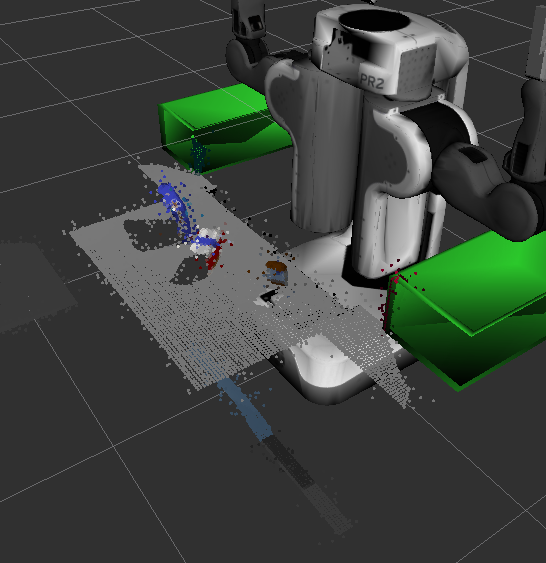
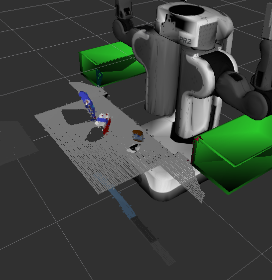
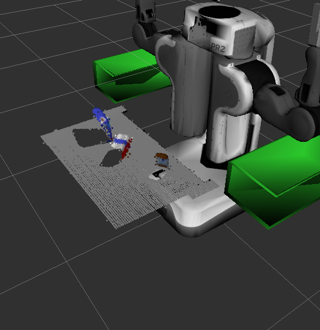
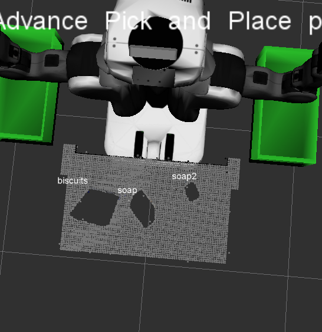
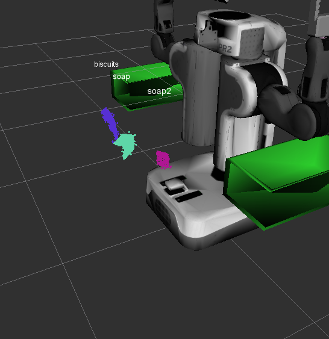
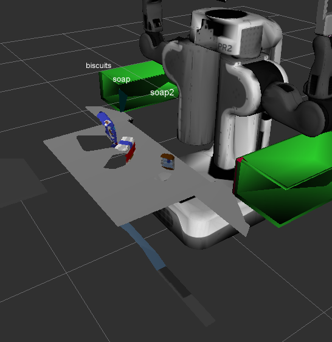
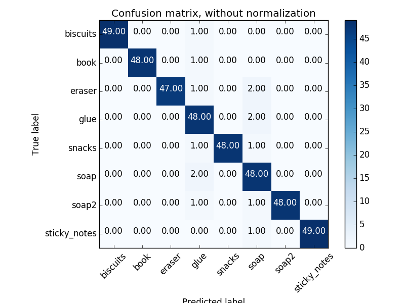
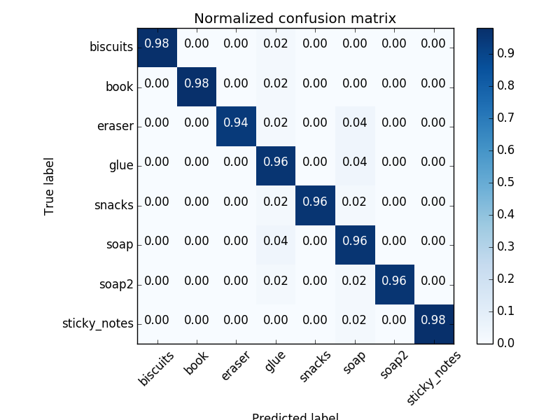

## Project: Perception Pick & Place

---

#### 1. Complete Pipeline for filtering and RANSAC plane fitting implemented.
1. Once cloud is being loaded, down-sample the cloud with Voxel filter. Down-sampling helps in reducing density of the points cloud.

   a. Before Outlier filtering output
 



```
## Voxel Grid filter
vox =  cloud.make_voxel_grid_filter()

# Choose a voxel size (also known as leaf)
LEAF_SIZE = 0.01

# Set voxel or leaf size
vox.set_leaf_size(LEAF_SIZE, LEAF_SIZE, LEAF_SIZE)

# Call filter function to obtain the resultant down-samples point cloud
cloud_filtered = vox.filter()
```
   b. As PR2 sensor had noise, to remove the noisy data Outlier filter has been used (Below output is after applying outlier filter)



```
# outlier filtering
olfilter = pcl_data.make_statistical_outlier_filter()
# set number of neighboring points to be analyzed
olfilter.set_mean_k(20)
# set threshold scale factor
th_scale_factor = 1.0
# mean + th_scale_factor * sd
olfilter.set_std_dev_mul_thresh(th_scale_factor)
# Apply the filter
cloud_filtered = olfilter.filter()
```

2. Passthrough filter applied to set the ROI or indirectly remove not necessary cloud data from processing. I applied Passthrough filter in 2 steps.

   a. Z direction


```
# For z direction
passthrough = cloud_filtered.make_passthrough_filter()
passthrough.set_filter_field_name('z')
axis_min = 0.6
axis_max = 0.9
passthrough.set_filter_limits(axis_min, axis_max)
cloud_filtered = passthrough.filter()
```

   b. Y direction



```
# For y direction
passthrough = cloud_filtered.make_passthrough_filter()
passthrough.set_filter_field_name('y')
axis_min = -0.5
axis_max = 0.5
passthrough.set_filter_limits(axis_min, axis_max)
cloud_filtered = passthrough.filter()
```
  
4. RANSAC plane fitting done to identify table (rectangle / plane) surface. Once table identified, negative of it provides objects on the table.


```
# TODO: RANSAC Plane Segmentation to identify tabletop & remove it
seg = cloud_filtered.make_segmenter()
seg.set_model_type(pcl.SACMODEL_PLANE)
seg.set_method_type(pcl.SAC_RANSAC)
max_distance = 0.01
seg.set_distance_threshold(max_distance)
inliers, coeff = seg.segment()

# TODO: Extract inliers and outliers
cloud_table = cloud_filtered.extract(inliers, negative = False)
cloud_objects = cloud_filtered.extract(inliers, negative = True)
```



#### 2. Complete Exercise 2 steps: Pipeline including clustering for segmentation implemented.  

5. Euclidean clustering done to identify different objects. Clustering identifies each individual objects. As Euclidean clustering uses
XYZ data only, objects cloud converted from XYZRGB to XYZ. k-d tree space-partitioning data structure helps in nearest neighbour seraches.

```
# TODO: Euclidean Clustering
white_cloud = XYZRGB_to_XYZ(cloud_objects)
tree = white_cloud.make_kdtree()

# Create a cluster extraction object
ec = white_cloud.make_EuclideanClusterExtraction()
# Set tolerances for distance threshold
# as well as min & max cluster size (in points)
ec.set_ClusterTolerance(0.02)
ec.set_MinClusterSize(10)
ec.set_MaxClusterSize(1500)
#Serach kd tree for clusters
ec.set_SearchMethod(tree)
#Extract indices for each of the discovered clusters
cluster_indices = ec.Extract()
```
   * Further for display / visualization purpose identified clusters / objects been color coded

```
# TODO: Create Cluster-Mask Point Cloud to visualize each cluster separately
# Assign a color corresponding to each  segmented object in the scene
cluster_color = get_color_list(len(cluster_indices))

color_cluster_point_list = []

for j, indices in enumerate(cluster_indices):
	for i, indice in enumerate(indices):
	    color_cluster_point_list.append([white_cloud[indice][0],
                                    white_cloud[indice][1],
                                    white_cloud[indice][2],
                                    rgb_to_float(cluster_color[j])])


# Cretae new cloud containing all clusters, each with unique color
cluster_cloud = pcl.PointCloud_PointXYZRGB()
cluster_cloud.from_list(color_cluster_point_list)
```


6. PCL data converted to ROS messages & published

#### 2. Complete Exercise 3 Steps.  Features extracted and SVM trained.  Object recognition implemented.

7. In next step, to classify each object. Following loop goes through each cluster one by one & performs following operations

   a. Computer feature vector
      - Color Histogram
      - Normal histograms

   b. Trained SVM (RBF kernel) model, used for classification / inference

   c. SVM inference provides label for the object - Ex., biscuits, snacks, soap, etc.

   d. Display detected label on rviz display

   e. Add objects label & cloud points to detected_object list

   f. After completion of entire loop (all the objects classification) is being published

```
# Classify the clusters! (loop through each detected cluster one at a time)
detected_object_labels = []
detected_objects = []

for index, pts_list in enumerate(cluster_indices):

	# Grab the points for the cluster
	pcl_cluster = cloud_objects.extract(pts_list)

	ros_cluster = pcl_to_ros(pcl_cluster)

	# Compute the associated feature vector
	chists = compute_color_histograms(ros_cluster, using_hsv=True)
	normals = get_normals(ros_cluster)
	nhists = compute_normal_histograms(normals)
	feature = np.concatenate((chists, nhists))

	# Make the prediction
	prediction = clf.predict(scaler.transform(feature.reshape(1,-1)))
	label = encoder.inverse_transform(prediction)[0]
	detected_object_labels.append(label)

	# Publish a label into RViz
	label_pos = list(white_cloud[pts_list[0]])
	label_pos[2] += .4
	objects_markers_pub.publish(make_label(label,label_pos,index))

	# Add the detected object to the list of detected objects.
	do = DetectedObject()
	do.label = label
	do.cloud = pcl_to_ros(pcl_cluster)
	detected_objects.append(do)

rospy.loginfo('Detected {} objects: {}'.format(len(detected_object_labels),detected_object_labels))

# Publish the list of detected objects
detected_object_pub.publish(detected_objects)
```


   a. SVM training
   - SVM training has been done separately using _train_svm.py_ & _capture_features.py_
   - I have used variation of 50 different views for each object
   - While RBF kernel used for better accuracy
   - Overall 96% accuracy achieved





### Pick and Place Setup

#### 1. For all three tabletop setups (`test*.world`), perform object recognition, then read in respective pick list (`pick_list_*.yaml`). Next construct the messages that would comprise a valid `PickPlace` request output them to `.yaml` format.

8. For selecting different world - Change variable _test_scene_num.data = 1_ in below code (Other than _pick_place_project.launch_)
 
```
# TODO: Initialize variables
# test scene number
test_scene_num = Int32()
test_scene_num.data = 1
# object name
object_name = String()
# arm name
arm_name = String()
# Pick Pose
pick_pose = Pose()
# Place pose
place_pose = Pose()
```

9. Following code reads / parses _'/object_list'_ parameters & loads each objects name & group as per current loaded world. Further to identify each objects dropbox, _'/dropbox'_ parameters being parsed. Dropbox parameters also contains position of the green & red dropbox in the world. Which will be further used for dropping objects into repstive bins.

```
# TODO: Get/Read parameters
object_list_param = rospy.get_param('/object_list')

# TODO: Parse parameters into individual variables
object_name_list = []
object_group_list = []
for i, object_param_i in enumerate(object_list_param):
	object_name_list.append(object_param_i['name'])
	object_group_list.append(object_param_i['group'])

# Pick up from dropbox parameters
dropbox_list_param = rospy.get_param('/dropbox')
# TODO: Parse parameters into individual variables
dropbox_name_list = []
dropbox_group_list = []
dropbox_position_list = np.zeros((2,3))
for i, dropbox_param_i in enumerate(dropbox_list_param):
	dropbox_name_list.append(dropbox_param_i['name'])
	dropbox_group_list.append(dropbox_param_i['group'])
	dropbox_position_list[i,:] = dropbox_param_i['position']
```

10. Following lines of code creates yaml messages & dumps as a file. Following steps performed

	a. Loop thorough pick list

	b. identify corresponding identified / correctly classified object & calculate it's mean

	c. Correctly identified object's centroids / mean is being added to list & _pick_pose_

	d. For each correctly identified object, corresponding dropbox identified after parsing group information

	e. For each object dropbox location / co-ordinates are read & copied to the _plcae_pose_

	f. yaml dictionary created for each object

	g. Completion of the loop, yaml dictionary list saved to the file


```
# TODO: Loop through the pick list
centroids = []
dict_list = []
for i in range(len(object_name_list)):
   	obj_name_i = object_name_list[i]
	obj_group_i = object_group_list[i]

	# TODO: Get the PointCloud for a given object and obtain it's centroid
	pth_mean = []
	np_mean = np.zeros(3)
	for j, object_j in enumerate(object_list):
	    
	    if(obj_name_i == object_j.label):
	    	cloud_arr = ros_to_pcl(object_j.cloud).to_array()
		np_mean = np.mean(cloud_arr, axis=0)[:3]
		pth_mean.append(np.asscalar(np_mean[0]))
		pth_mean.append(np.asscalar(np_mean[1]))
		pth_mean.append(np.asscalar(np_mean[2]))

	# if found correct label then only go for further process
	if pth_mean:
	    centroids.append(pth_mean)
	# no correct label found
	else:
	    print('list empty')
	    continue

	# TODO: Create 'place_pose' for the object

	# object name
	object_name.data = obj_name_i
	# arm name
	if obj_group_i == 'green':
	    arm_name.data = 'right'
	else:
	    arm_name.data = 'left'
	# Pick Pose
	pick_pose.position.x = pth_mean[0]
	pick_pose.position.y = pth_mean[1]
	pick_pose.position.z = pth_mean[2]
	# TODO: Assign the arm to be used for pick_place
	# Place pose
	for j, dropbox_group_j in enumerate(dropbox_group_list):
	    if dropbox_group_j == obj_group_i:
		 place_pose.position.x = np.asscalar(dropbox_position_list[j][0])
		 place_pose.position.y = np.asscalar(dropbox_position_list[j][1])
		 place_pose.position.z = np.asscalar(dropbox_position_list[j][2])

	# TODO: Create a list of dictionaries (made with make_yaml_dict()) for later output to yaml format
	yaml_dict = make_yaml_dict(test_scene_num, arm_name, object_name, pick_pose, place_pose)
	dict_list.append(yaml_dict)

# TODO: Output your request parameters into output yaml file
file_name = 'output_' + str(test_scene_num.data) + '.yaml'
send_to_yaml(file_name, dict_list)
```


Spend some time at the end to discuss your code, what techniques you used, what worked and why, where the implementation might fail and how you might improve it if you were going to pursue this project further.  

My experience / techniques used
1. With more variations / data SVM performance improved
2. SVM training RBF had a better performance once enough data / features being provided. (With less data linear kernel performed better)
3. Better features required to improve the performance. I achieved following although training performance was 96%

   a. test_world1 - 100 %

   b. test_world2 - 80%

   c. test_world3 - 87.5%

4. I tried rotating the robot (for collision map). With normal command passing it slowly reached till 90 degree angle & stopped moving.

Future Improvement
1. I need to figure out way to know, what's the current angle of pr2. It would be great if that information can be shared. (I tried to read /joint_states)'
2. I would like to further implement pick & place server

